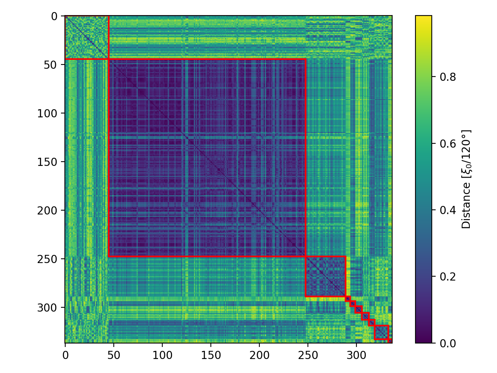
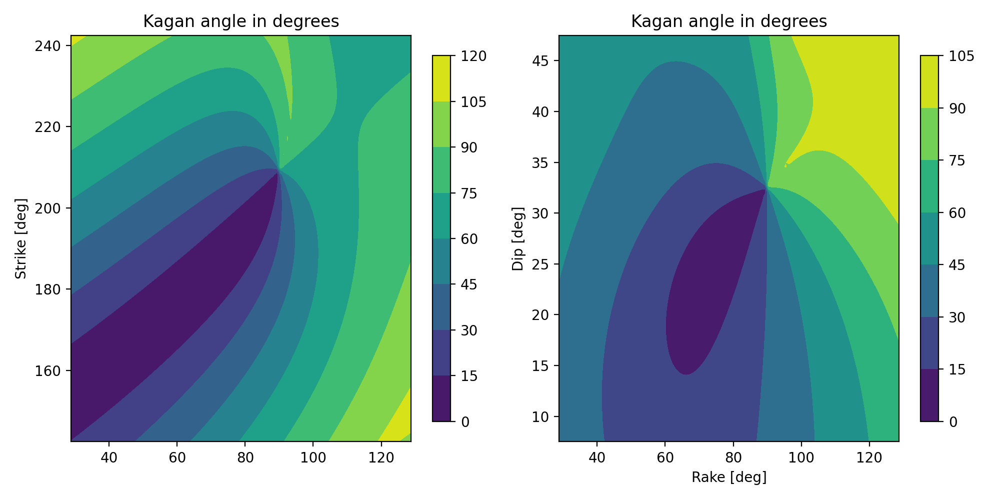
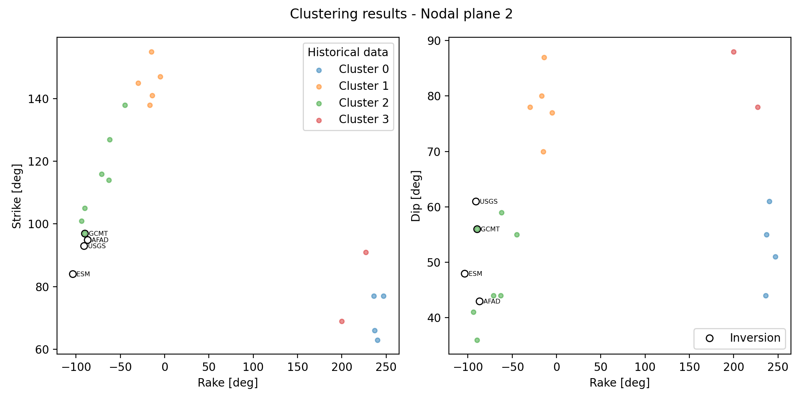
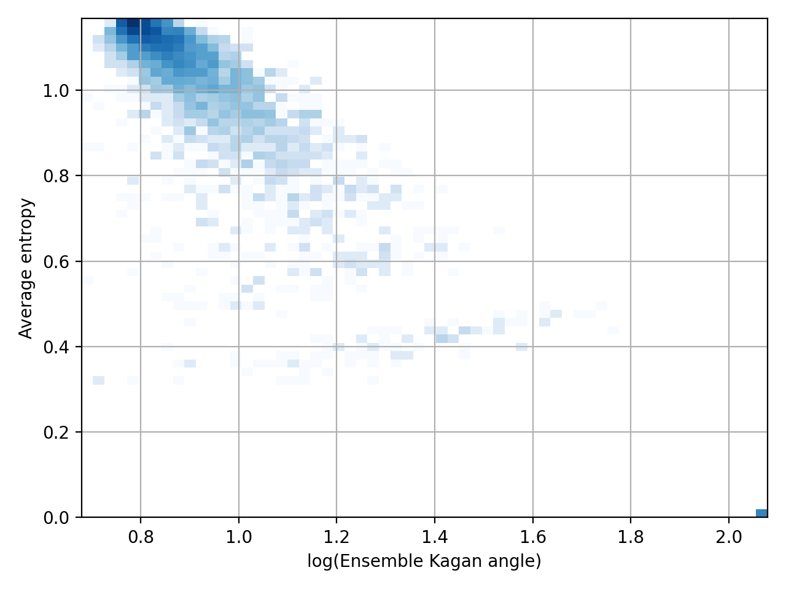

# Clustering: Tohoku
The 2011 Tōhoku earthquake and tsunami occurred on 11 March 2011. The magnitude 9.0–9.1 (Mw) undersea megathrust earthquake had an epicenter in the Pacific Ocean, 72 km east of the Oshika Peninsula of the Tōhoku region, and lasted approximately six minutes, causing a tsunami.

[Reference](https://en.wikipedia.org/wiki/2011_T%C5%8Dhoku_earthquake_and_tsunami){.right}<br>

<hr />
::: block
<p>[DBSCAN - Density-Based Spatial Clustering of Applications with Noise]{.under}</p>
Finds core samples of high density and expands clusters from them. Good for data which contains clusters of similar density.
:::

[Configuration block:]{.left}<br>
```python
fname_catalogue  = SPUD_QUAKEML_bundle_2022-06-16T11.48.12.xml
maxDistance      = 120
epicentre_lat    = 38.322
epicentre_lon    = 142.369
eps              = [0.13,0.20] #15.6 24.0
min_samples      = 4
```

## Tohoku: Distance matrix

:::::::::::::: {.columns}
::: {.column width="50%"}
Traditional DBSCAN clustering...

:::
::: {.column width="50%"}
Two-step clustering...

:::
::::::::::::::

## Tohoku: Clusters for nodal plane 1


## Tohoku: Kagan angle contours


# Clustering: Samos
An earthquake with a moment magnitude of 6.9–7.0 occurred on 30 October 2020 about 14 km northeast of the Greek island of Samos.

The Turkish city İzmir, 70 km northeast, was severely affected. <span class="fragment highlight-red">One hundred and seventeen people died</span> in İzmir Province while an additional 1,034 were injured. 

[Reference](https://en.wikipedia.org/wiki/2020_Aegean_Sea_earthquake){.right}<br>

<hr />
[Configuration block:]{.left}<br>
```python
fname_catalogue  = Mediterranean_SPUD_QUAKEML_bundle_2021-07-30T09.51.41.xml
maxDistance      = 90
epicentre_lat    = 37.918
epicentre_lon    = 26.790
eps              = [0.15, 0.30] #18.0 36.0
min_samples      = 2
```

## Samos: Distance matrix


## Samos: Clusters for nodal plane 1


## Samos: Clusters for nodal plane 2



# Sensitivity analysis

Variables to be perturbed:

* <span class="fragment highlight-red">Focal mechanism parameters (strike,dip,rake)</span>
* Source depth
* Moment magnitude (Mw)
* Location (latitude,longitude)

## Sampling from a multivariate normal distribution

$$ f_{\mathbf {X} }(x_{1},\ldots ,x_{k})={\frac {\exp \left(-{\frac {1}{2}}({\mathbf {x} }-{\boldsymbol {\mu }})^{\mathrm {T} }{\boldsymbol {\Sigma }}^{-1}({\mathbf {x} }-{\boldsymbol {\mu }})\right)}{\sqrt {(2\pi )^{k}|{\boldsymbol {\Sigma }}|}}} $$

| Mean vector | Covariance matrix | 
| -------- | -------- | 
| $$\boldsymbol{\mu} = (113.94, 47.86, -73.64)$$     | $$\Sigma = \begin{pmatrix} 214.67&61.00&255.67\\-&76.48&80.57\\-&-&337.62 \end{pmatrix} $$     |

Correlation matrix:
$$\rho = \begin{pmatrix} 1.0&0.48&0.95\\-&1.0&0.5\\-&-&1.0 \end{pmatrix} $$

## Sensitivity analysis for single cluster


## Ensemble Kagan angle

:::::::::::::: {.columns}
::: {.column width="40%"}
definition...
$$ \overline {d} = \frac{1}{N} \sum_i^N d_i $$
where $d_i$ is the minimum Kagan angle between the i-th sample and the remaining samples: 
$$d_i = \min_{j,j\ne i} \theta_{ij}$$
:::
::: {.column width="60%"}
results for 40 simulations...

:::
::::::::::::::

# Ensemble simulations

* Are we over- or sub-sampling the cluster?
* How many members are required to properly sample the parameter space?
* Are the distributions converging?
* What are the most sensitive variables?

## Entropy for different ensemble sizes


## Entropy for different ensemble sizes
{width=50%}

## Is the distribution converging?
<video data-autoplay src="figures/histogram.mp4" width="70%"></video>

## What about low-order moments?


[Very preliminar results]{.under}

## Comparison with observations


# Conclusions
We showed here:

* It is possible to classify historical data measuring the pairwise distance between samples in terms of the Kagan angle
* By taking into account correlations between strike, dip and rake we were able to reduce significantly the sampled parameter space
* Using the computational resources typically available in HPC center, we cannot expect convergence of the probability distribution. However, it is probably possible for low order moments with a reasonable ensemble size.
* Numerical simulations are highly sensitive to changes in Focal mechanism parameters (strike,dip,rake), source depth, and moment magnitude (strong non-linear dynamics involved).
* Perturbation in the horizontal location (latitude and longitude) had a marginal effect (a simple translation).

# Thanks {data-transition="zoom"}


